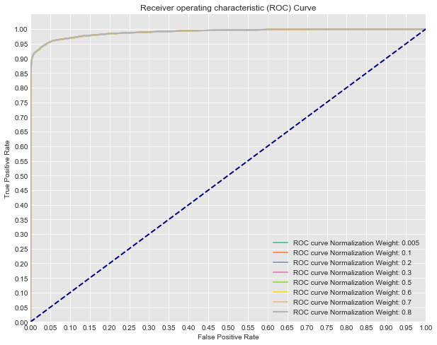

```python
import pandas as pd
```

# Predicting Credit Card Fraud
Load the **creditcard.csv** file, split into training and test sets, and fit a logistic regression model to the training data.  
Then plot the ROC curve and confusion matrix for your test sets.


```python
df = pd.read_csv('creditcard.csv.gz', compression='gzip') #Here we load a compressed csv file.
df.head()
```


<div>
<style scoped>
    .dataframe tbody tr th:only-of-type {
        vertical-align: middle;
    }

    .dataframe tbody tr th {
        vertical-align: top;
    }

    .dataframe thead th {
        text-align: right;
    }
</style>
<table border="1" class="dataframe">
  <thead>
    <tr style="text-align: right;">
      <th></th>
      <th>Unnamed: 0</th>
      <th>Time</th>
      <th>V1</th>
      <th>V2</th>
      <th>V3</th>
      <th>V4</th>
      <th>V5</th>
      <th>V6</th>
      <th>V7</th>
      <th>V8</th>
      <th>...</th>
      <th>V21</th>
      <th>V22</th>
      <th>V23</th>
      <th>V24</th>
      <th>V25</th>
      <th>V26</th>
      <th>V27</th>
      <th>V28</th>
      <th>Amount</th>
      <th>Class</th>
    </tr>
  </thead>
  <tbody>
    <tr>
      <th>0</th>
      <td>0</td>
      <td>0.0</td>
      <td>-1.359807</td>
      <td>-0.072781</td>
      <td>2.536347</td>
      <td>1.378155</td>
      <td>-0.338321</td>
      <td>0.462388</td>
      <td>0.239599</td>
      <td>0.098698</td>
      <td>...</td>
      <td>-0.018307</td>
      <td>0.277838</td>
      <td>-0.110474</td>
      <td>0.066928</td>
      <td>0.128539</td>
      <td>-0.189115</td>
      <td>0.133558</td>
      <td>-0.021053</td>
      <td>149.62</td>
      <td>0</td>
    </tr>
    <tr>
      <th>1</th>
      <td>1</td>
      <td>0.0</td>
      <td>1.191857</td>
      <td>0.266151</td>
      <td>0.166480</td>
      <td>0.448154</td>
      <td>0.060018</td>
      <td>-0.082361</td>
      <td>-0.078803</td>
      <td>0.085102</td>
      <td>...</td>
      <td>-0.225775</td>
      <td>-0.638672</td>
      <td>0.101288</td>
      <td>-0.339846</td>
      <td>0.167170</td>
      <td>0.125895</td>
      <td>-0.008983</td>
      <td>0.014724</td>
      <td>2.69</td>
      <td>0</td>
    </tr>
    <tr>
      <th>2</th>
      <td>2</td>
      <td>1.0</td>
      <td>-1.358354</td>
      <td>-1.340163</td>
      <td>1.773209</td>
      <td>0.379780</td>
      <td>-0.503198</td>
      <td>1.800499</td>
      <td>0.791461</td>
      <td>0.247676</td>
      <td>...</td>
      <td>0.247998</td>
      <td>0.771679</td>
      <td>0.909412</td>
      <td>-0.689281</td>
      <td>-0.327642</td>
      <td>-0.139097</td>
      <td>-0.055353</td>
      <td>-0.059752</td>
      <td>378.66</td>
      <td>0</td>
    </tr>
    <tr>
      <th>3</th>
      <td>3</td>
      <td>1.0</td>
      <td>-0.966272</td>
      <td>-0.185226</td>
      <td>1.792993</td>
      <td>-0.863291</td>
      <td>-0.010309</td>
      <td>1.247203</td>
      <td>0.237609</td>
      <td>0.377436</td>
      <td>...</td>
      <td>-0.108300</td>
      <td>0.005274</td>
      <td>-0.190321</td>
      <td>-1.175575</td>
      <td>0.647376</td>
      <td>-0.221929</td>
      <td>0.062723</td>
      <td>0.061458</td>
      <td>123.50</td>
      <td>0</td>
    </tr>
    <tr>
      <th>4</th>
      <td>4</td>
      <td>2.0</td>
      <td>-1.158233</td>
      <td>0.877737</td>
      <td>1.548718</td>
      <td>0.403034</td>
      <td>-0.407193</td>
      <td>0.095921</td>
      <td>0.592941</td>
      <td>-0.270533</td>
      <td>...</td>
      <td>-0.009431</td>
      <td>0.798278</td>
      <td>-0.137458</td>
      <td>0.141267</td>
      <td>-0.206010</td>
      <td>0.502292</td>
      <td>0.219422</td>
      <td>0.215153</td>
      <td>69.99</td>
      <td>0</td>
    </tr>
  </tbody>
</table>
<p>5 rows × 32 columns</p>
</div>


```python
#Your code here
```

# Tuning 
Try some of the various techniques proposed to tune your model. Compare your models using AUC, ROC or another metric.


```python
#Your code here
```

### SMOTE
If you haven't already, try using the SMOTE class from the imblearn package in order to improve the model's performance on the minority class.


```python
#Your code here
```

## Analysis
Describe what is misleading about the AUC score and ROC curves produced by this code:


```python
print(y.value_counts()) #Previous original class distribution
X_resampled, y_resampled = SMOTE().fit_sample(X, y) 
print(pd.Series(y_resampled).value_counts()) #Preview synthetic sample class distribution

X_train, X_test, y_train, y_test = train_test_split(X_resampled, y_resampled, random_state=0)

# Now let's compare a few different regularization performances on the dataset:
C_param_range = [0.005, 0.1, 0.2, 0.3, 0.5, 0.6, 0.7, 0.8]
names = [0.005, 0.1, 0.2, 0.3, 0.5, 0.6, 0.7, 0.8, 0.9]
colors = sns.color_palette("Set2", n_colors=len(names))

plt.figure(figsize=(10,8))

for n, c in enumerate(C_param_range):
    #Fit a model
    logreg = LogisticRegression(fit_intercept = False, C = c) #Starter code
    model_log = logreg.fit(X_train, y_train)
    print(model_log) #Preview model params

    #Predict
    y_hat_test = logreg.predict(X_test)

    y_score = logreg.fit(X_train, y_train).decision_function(X_test)

    fpr, tpr, thresholds = roc_curve(y_test, y_score)
    
    print('AUC for {}: {}'.format(names[n], auc(fpr, tpr)))
    lw = 2
    plt.plot(fpr, tpr, color=colors[n],
             lw=lw, label='ROC curve Normalization Weight: {}'.format(names[n]))
plt.plot([0, 1], [0, 1], color='navy', lw=lw, linestyle='--')
plt.xlim([0.0, 1.0])
plt.ylim([0.0, 1.05])

plt.yticks([i/20.0 for i in range(21)])
plt.xticks([i/20.0 for i in range(21)])
plt.xlabel('False Positive Rate')
plt.ylabel('True Positive Rate')
plt.title('Receiver operating characteristic (ROC) Curve')
plt.legend(loc="lower right")
plt.show()
```

    0    284315
    1       492
    Name: Class, dtype: int64
    1    284315
    0    284315
    dtype: int64
    LogisticRegression(C=0.005, class_weight=None, dual=False,
              fit_intercept=False, intercept_scaling=1, max_iter=100,
              multi_class='ovr', n_jobs=1, penalty='l2', random_state=None,
              solver='liblinear', tol=0.0001, verbose=0, warm_start=False)
    AUC for 0.005: 0.9896316604116544
    LogisticRegression(C=0.1, class_weight=None, dual=False, fit_intercept=False,
              intercept_scaling=1, max_iter=100, multi_class='ovr', n_jobs=1,
              penalty='l2', random_state=None, solver='liblinear', tol=0.0001,
              verbose=0, warm_start=False)
    AUC for 0.1: 0.9895212449858461
    LogisticRegression(C=0.2, class_weight=None, dual=False, fit_intercept=False,
              intercept_scaling=1, max_iter=100, multi_class='ovr', n_jobs=1,
              penalty='l2', random_state=None, solver='liblinear', tol=0.0001,
              verbose=0, warm_start=False)
    AUC for 0.2: 0.9895357741751738
    LogisticRegression(C=0.3, class_weight=None, dual=False, fit_intercept=False,
              intercept_scaling=1, max_iter=100, multi_class='ovr', n_jobs=1,
              penalty='l2', random_state=None, solver='liblinear', tol=0.0001,
              verbose=0, warm_start=False)
    AUC for 0.3: 0.9895520281663619
    LogisticRegression(C=0.5, class_weight=None, dual=False, fit_intercept=False,
              intercept_scaling=1, max_iter=100, multi_class='ovr', n_jobs=1,
              penalty='l2', random_state=None, solver='liblinear', tol=0.0001,
              verbose=0, warm_start=False)
    AUC for 0.5: 0.9894029084163987
    LogisticRegression(C=0.6, class_weight=None, dual=False, fit_intercept=False,
              intercept_scaling=1, max_iter=100, multi_class='ovr', n_jobs=1,
              penalty='l2', random_state=None, solver='liblinear', tol=0.0001,
              verbose=0, warm_start=False)
    AUC for 0.6: 0.9894655810337536
    LogisticRegression(C=0.7, class_weight=None, dual=False, fit_intercept=False,
              intercept_scaling=1, max_iter=100, multi_class='ovr', n_jobs=1,
              penalty='l2', random_state=None, solver='liblinear', tol=0.0001,
              verbose=0, warm_start=False)
    AUC for 0.7: 0.9896560083433634
    LogisticRegression(C=0.8, class_weight=None, dual=False, fit_intercept=False,
              intercept_scaling=1, max_iter=100, multi_class='ovr', n_jobs=1,
              penalty='l2', random_state=None, solver='liblinear', tol=0.0001,
              verbose=0, warm_start=False)
    AUC for 0.8: 0.989630892821384





# Your answer here  

